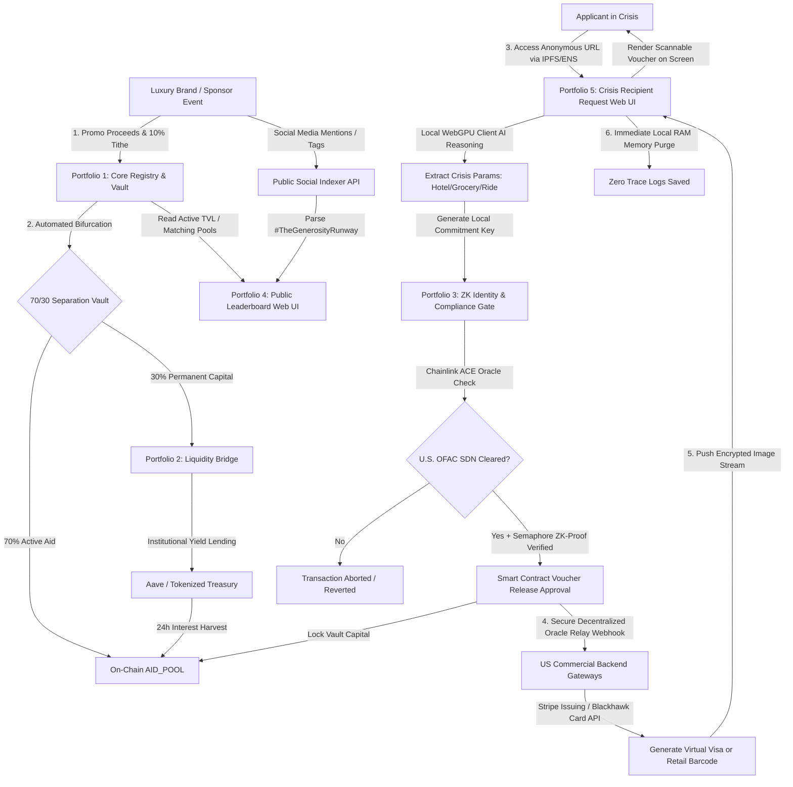

# 🧵 Couture Gives Back: The Generosity Runway Protocol
> An Open-Source, Parameter-Driven Layer-2 Architecture for Direct Mutual Aid, Haute Culture Rivalry, and Sustainable Craft Sponsorship.ave

## 🕊️ Executive Summary & Problem
As the economic divide between the rich and the poor grows ever wider, we are presented with a profound human crisis. Traditional charity frameworks seem to have collapsed into supporting only themselves, leaving everyday people with no relief channels.

We all want to help, but we often simply do not know how to make a meaningful difference against such a massive problem.   This platform protocol replaces helplessness with direct,  community agency, sourcing aid from enterprises that have the ability to easily provide them. The model rewards these enterprises with publicity that boosts their brand via the delight clients receive in knowing that their purchase is helping those who are less fortunate.

## 👑 The Solution: Haute Culture Competes for Who Can Give More
We celebrate these brands' inherent passion for prestige, creative excellence, and high-visibility leadership. High fashion is an industry built on historic rivalry, supreme social status, and a feel-good result for the clients who purchase their creations.

**#TheGenerosityRunway** operates as an elegant, competitive arena designed to gently entice these iconic brands forward. It implements philanthropy as a real-time celebration and contest of craftsmanship and ultimate societal benevolence. When everyday citizens and wealthy patrons tag their favorite houses with **#CoutureGivesBack**, they cast a clear vote to show off their "goods" in Giving to the platform aid funds.

**Brands May Choose Their Giving Levels**
Giving rates are tracked individually per house/brand. The system initializes with an achievable **1% challenge request baseline**. As friendly, real-time duels play out on the public leaderboard, the brands are enticed to dynamically scale their parameters up through **3%, 5%, and 7%**, until a house finally unlocks the current ultimate **10% milestone tithe**. Clients and fans of the brands may **#GiveMoreGoods** them to cheer them into ever higher levels of giving.

## 🫴 🤝 Those With Needs Apply for Them via the dApp and are Approved in Minutes 💸💸
The platform does not restrict aid to a certain group. It recognizes that all people may need help at different times in their lives. It satisfies those needs in the form of the goods, services, or accomodations requested or as cash to purchase them. Goods, services, and accomodations are acquired via automated APIs and recipients receive tokens to access them. Delivery services such as Uber and Lyft are utilized when delivery is necessary.  Each unique applicant will receive a certain amount (currently aimed at $300) of goods or services in a first request. This first request will require minimal digital identification as we understand that in a crisis it may be difficult to provide more rigorous credentials.  The system operates on an honor system. We are not the judges of who should receive aid or not.  For additional needs after the first request, more rigorous identification is requested to ensure that the platform is not abused and used for purposes other than individual and family crisis support. Goods and services are secured via automated APIs and tokens are provided to applicants to present to accept the secured provisions.

## 🎨 Platform Support for Upcycler Artists Product Sales Provides Additional Aid Funding via Sponsorship
Additionally, these couture houses/brands may sponsor independent upcyclers, whose creative wares are sold on the platform via a zero-deduction peer-to-peer marketplace. This adds a competitive sense for the upcyclers, who are not limited by how many sponsorships they may achieve. A sponsorship donates a percentage of the creator's sales to the platform aid funds. This percentage is not taken from the creator's proceeds. They are simply calculated based on them.  **Every upcycler automatically receives a baseline default platform sponsorship of 3%** funded by the protocol's aid capital reservoir. 

**Upcycler artists may create items branded with potential sponsors logos to solicit sponsorship from them.**
An artist item targeted for brand promotion and sponsorship solicitation will be tagged with the brand's hash tag so that the product appears on the brand's seeking sponsorship Runway along with other artist's products vying for the same Brand  sponsorship. 

**Couture Houses/Brands Benefit from a Venue of Innovative Crafts people and Artists that they may Discover and Potentially Hire .**

## 📐 Technical Architecture & Execution Sequence

The Couture Gives Back protocol operates via a 5-step automated, non-custodial pipeline across Layer-2 EVM rollups and decentralized infrastructure:

### Detailed Execution Breakdown

1. **The Campaign Ingress Layer:** When a high-couture promotional event occurs, matching pools and campaign tithes land directly into the **Core Registry & Vault** on-chain. Concurrently, the **Public Leaderboard Web UI** tracks real-time customer social media "Gashtag" votes alongside corporate balances.
2. **The Sovereign Recipient Interface:** An individual in crisis accesses the **Recipient Crisis Request Web UI** securely via an un-blockable IPFS portal. A localized browser-side AI engine translates their natural text into structured crisis parameters, preventing plain-text data from ever touching a centralized server.
3. **The Blockchain Compliance Shield:** The request is verified on-chain. The smart contract validates their Semaphore ZK-Proof (verifying eligibility anonymously) while a Chainlink Automation oracle checks the U.S. Treasury OFAC SDN list to legally de-risk the protocol.
4. **The Secure Financial Conversion:** Blockchains cannot call commercial web APIs directly. Once the contract clears compliance, it pulls capital from the aid pool and triggers a secure oracle bridge to instruct domestic US card issuers (like Stripe or Blackhawk). 
5. **The On-Screen Delivery:** The gateway issues an instant virtual Visa card or retail gift card barcode. This data stream is pushed straight back to the **Recipient Request Web UI**, rendering a crisp, scannable barcode directly onto the user's phone browser canvas for instant checkout dignity.

## 🏦 Platform Aid Fund Reserve Levels Provide Long Term Liquidity 🪙🪙🪙
The platform will maintain a large aid reserve capitol that is safely invested for capitol growth. This reserve capitol will allow continued aid support to bridge times when couture sponsorship may be low due to more difficult economic conditions.  

## 🛠️ Decentralized Technical Infrastructure
To protect the privacy of vulnerable populations, the platform is engineered as a public, decentralized utility completely disconnected from centralized corporate gateways:
- **Censorship-Resistant Frontend:** Hosted permanently on peer-to-peer IPFS nodes and mapped to a `.eth` ENS domain.
- **Zero-PII Identity Layer:** Utilizing Semaphore Zero-Knowledge (ZK) Proof primitives to verify unique human eligibility without collecting database logs, names, or locations.
- **On-Device AI Navigator:** Powered by an open-source AI executing inside an isolated, decentralized GPU runtime model, auto-wiping chat memory instantly upon voucher generation.
- **Compliance Shield:** Real-time on-chain OFAC SDN database queries via the Chainlink Automated Compliance Engine (ACE), optimized to secure a FinCEN No-Action Letter and an OFAC Interpretive Ruling.

## 📊 Pre-Seed Funding Roadmap & Capital Allocation ($76,000 Total Target)

We are actively raising a baseline setup fund via Non-Dilutive Ecosystem Grant Milestones and Safe Multi-Sig execution to manifest our dual-entity legal frameworks (Delaware Non-Profit + Swiss Association Verein) and push our prototype code live.

### 🛠️ Hard Deliverable Milestones ($55,000)
*   🏛️ **Phase 1: Entity & Compliance Manifestation** — `$8,000`  
    *Legal formation, Swiss Verein structuring, and FinCEN No-Action framework completion.*
*   💻 **Phase 2: Web3 Websites, dApps,& Smart Contract Foundation** — `$37,000`  
    *Escrow allocations for core MVP protocol deliverables detailed in our paid task list.*
*   🎨 **Phase 3: Visual Leaderboard Design & Creator Outreach** — `$10,000`  
    *Frontend asset creation, UI/UX polishing, and initial couture house onboardings.*

### 🛠️ Cross-Phase Technical Architecture Oversight ($21,000)
* **Allocation:** `$21,000` total ($7,000 per month over 3 month launch runway).
* **Purpose:** Active engineering mobilization, repository maintenance, and protocol architecture oversight.
  
To ensure strict security compliance, this stipend is directly tied to the following structural milestones handled by the Founder/Architect:
1. **Developer Vetting & Code Review:** Acting as the core repository maintainer, reviewing all PR submissions from the paid engineering portfolios, and verifying gas optimizations.
2. **Multi-Sig Administration:** Setting up, securing, and managing the multi-signature operational safes for milestone contract distributions.
3. **Ecosystem & Integration Strategy:** Directing the live integration of the Chainlink Automated Compliance Engine and managing conversations with decentralized oracle networks.
4. **Mainnet Deployment Supervision:** Managing the migration from L2 testnet environments to live consumer deployment states.

## 🤝 Paid Engineering Contracts
We are soliciting senior Web3/Solidity developers for fully paid, milestone-based development contracts. We do not rely on open-source volunteers. If you are an experienced Solidity or Wasm engineer, please review our [PAID CONTRACT TASK LIST](./PAID_CONTRACT_TASK_LIST.md)  and submit your portfolio to our founding team if you are qualified and interested in doing some or all of the tasks in the list..

